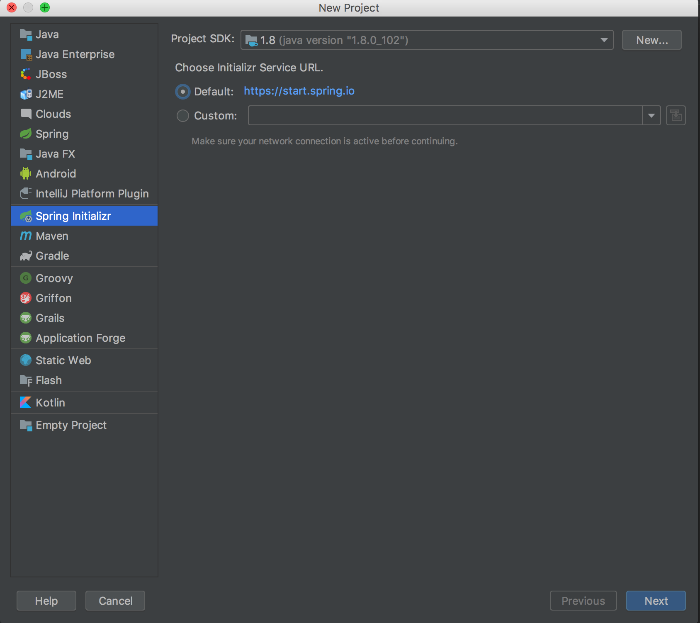
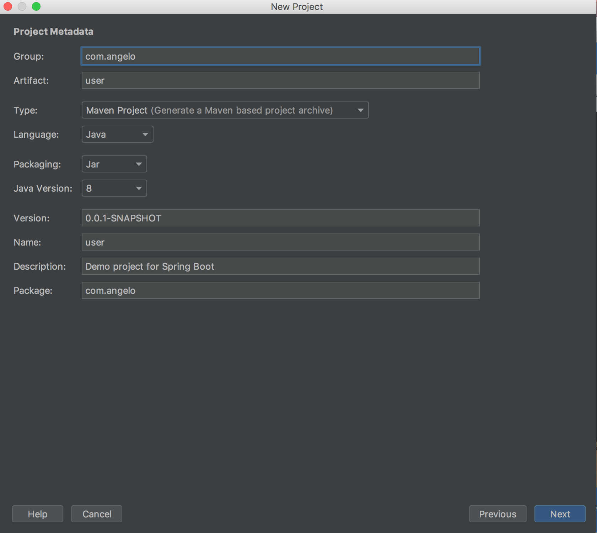
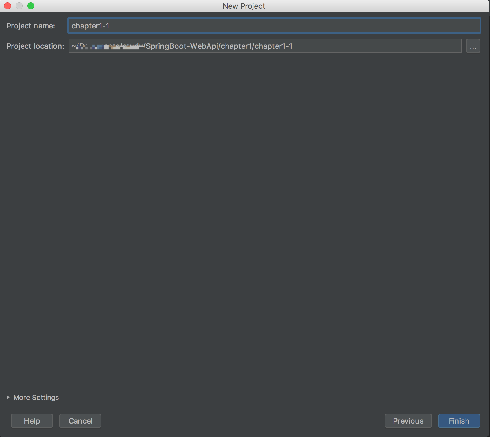

# 项目构建

## IntelliJ IDEA 中的Spring Initializr快速构建SpringBoot工程
## intellig编辑器创建

* 菜单栏中选择 ```File``` => ```File``` => ```Project```，可以看到下图弹出创建窗口，左侧默认指向Spring Initializr，右侧Choose Initializr Service Url 默认指向 https://start.spring.io/ ，这是Spring官方提供的，在这里也可以创建工程项目。



* 点击```Next```进入下一步，Group: 自己可以根据自己的喜爱命名，自己的名字等都可以；Name：我们这里设置为user；Type：选择Maven；更多参数设置参考以下图片示例



* 点击```Next```进入下一步，可以看到很多Spring的组件供我们选择，这里只选择Web。


* 点击```Next```进入下步，选择项目的存储位置，点击Finish完成整个工程的构建



通过以上步骤完成了项目的创建，下面让我们来看下基本的项目结构：

<pre>
├── src                   业务代码目录
    ├── main  
        ├── java          程序入口
            ...
        ├── resources     资源配置文件
            ...
    ├── test              单元测试目录
        ├── 
├── pom.xml
</pre>

``` pom.xml ``` 
* spring-boot-starter-web: Web项目模块依赖
* spring-boot-starter-test: 测试模块依赖
* spring-boot-maven-plugin: Maven构建项目插件

```xml
...
    <dependencies>
        <dependency>
            <groupId>org.springframework.boot</groupId>
            <artifactId>spring-boot-starter-web</artifactId>
        </dependency>

        <dependency>
            <groupId>org.springframework.boot</groupId>
            <artifactId>spring-boot-starter-test</artifactId>
            <scope>test</scope>
        </dependency>
    </dependencies>

    <build>
        <plugins>
            <plugin>
                <groupId>org.springframework.boot</groupId>
                <artifactId>spring-boot-maven-plugin</artifactId>
            </plugin>
        </plugins>
    </build>
...
```

## 编写一个hello-springboot-程序

[源码地址](/chapter1-1)

创建 ``` HelloControllerl ``` 类，内容如下

```java
package com.angelo;

import org.springframework.web.bind.annotation.RequestMapping;
import org.springframework.web.bind.annotation.RestController;
import org.springframework.web.bind.annotation.RequestMethod;

@RestController
public class HelloController {

    @RequestMapping(value = "/hello", method = RequestMethod.GET)
    public String say() {
        return "Hello SpringBoot!!!";
    }
}
```

启动有多种方式，让我们分别看下
* 方法一：启动类上，右键单机运行 ``` Run 'UserApplication' ```


* 方法二：进到项目根目录执行命令 ``` mvn spring-boot:run ```
* 方法三：
    * 先执行命令进行编译 ``` mvn install ```
    * 进到target目录可以看到有个 ``` user-0.0.1-SNAPSHOT.jar ```文件
    ```s
    $ cd target   
    $ ls
    classes					maven-archiver				test-classes
    generated-sources			maven-status				user-0.0.1-SNAPSHOT.jar
    generated-test-sources			surefire-reports			user-0.0.1-SNAPSHOT.jar.original
    ```
    * 通过java -jar命令启动 ``` java -jar user-0.0.1-SNAPSHOT.jar ```

打开浏览器访问```http://localhost:8080/hello```，可以看到页面输出```Hello SpringBoot!!!```
