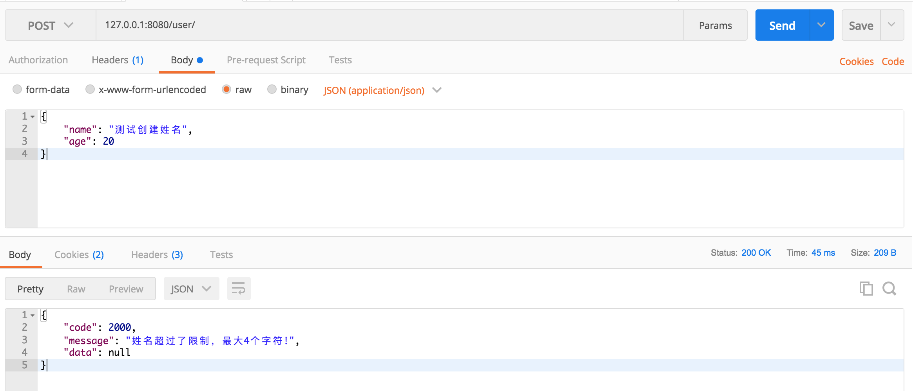

# 统一异常处理

> 项目开发中保证零异常似乎是不可能的，不论是系统异常还是程序本身的编码问题造成的异常信息都要以一种约定的数据结构返回，友好的处理方式在前后端分离模式下（后端提供API接口给到前端）能大大增加大家的沟通、工作效率。基于Spring Boot进行异常统一处理，本文中主要用到```@ControllerAdvice```注解。

## 快速导航

* [统一返回数据结构](/chapter4/README.md#统一返回数据结构)
    * `[统一返回数据结构]` 定义接口返回数据结构
    * `[统一返回数据结构]` 数据接口字段模型定义
    * `[统一返回数据结构]` 封装接口返回方法（成功失败）
* [统一异常处理](/chapter4/README.md#统一异常处理)
    * `[统一异常处理]` 状态消息枚举
    * `[统一异常处理]` 自定义异常类
    * `[统一异常处理]` @ControllerAdvice统一处理异常
* [测试](/chapter4/README.md#测试)
    * `[测试]` 测试正常返回及空指针系统异常
    * `[测试]` 自定义异常测试


本文示例基于[Spring Boot实战系列(3)AOP面向切面编程 /chapter3/chapter3-1](https://github.com/Q-Angelo/SpringBoot-Course/tree/master/chapter3/chapter3-1)可在Github获取源码

## 统一返回数据结构

#### 定义接口返回数据结构

先定义接口返回数据结构，code为0表示操作成功，非0表示异常。其中data只有在处理成功才会返回，其他情况不会返回，或者那些不需要返回数据的接口（更新、删除...）

```json
{
 	"code": 0,
 	"message": "SUCCESS",
 	"data": {

 	}
}
```

#### 数据接口字段模型定义

创建```/domain/Result.java```类，对以上数据接口涉及的字段进行定义。

```Result.java```
```java
package com.angelo.domain;

public class Result<T> {
    private Integer code; // 状态码

    private String message; // 状态描述信息

    private T data; // 定义为范型

    // 以下 getter、setter方法省略
}
```

#### 封装接口返回方法

创建```/util/MessageUtil.java```类，对返回的成功、失败进行统一封装。

```MessageUtil.java```

```java
package com.angelo.util;

import com.angelo.domain.Result;

public class MessageUtil {

    /**
     * 成功方法
     * @param object
     * @return
     */
    public static Result success(Object object) {
        Result result = new Result();
        result.setCode(0);
        result.setMessage("SUCCESS");
        if (object != null) {
            result.setData(object);
        }

        return result;
    }

    /**
     * 成功但是
     */
    public static Result success() {
        return success(null);
    }

    /**
     * 失败方法
     * @param code
     * @param message
     * @return
     */
    public static Result error(Integer code, String message) {
        Result result = new Result();
        result.setCode(code);
        result.setMessage(message);

        return result;
    }
}
```

## 统一异常处理

#### 状态消息枚举

项目用到的状态码、描述信息要有个文件统一去做枚举定义，一方面可以实现复用，另一方面如果状态码、描述有改动只需要在定义枚举的地方改动即可。

新建```/enums/MessageEnum.java```枚举

```java
package com.angelo.enums;

public enum MessageEnum {
    SYSTEM_ERROR(1001, "系统异常"),
    NAME_EXCEEDED_CHARRACTER_LIMIT(2000, "姓名超过了限制，最大4个字符!");

    private Integer code;

    private String message;

    MessageEnum(Integer code, String message) {
        this.code = code;
        this.message = message;
    }

    public Integer getCode() {
        return code;
    }

    public String getMessage() {
        return message;
    }
}
```

#### 自定义异常类

> Spring Boot框架只对抛出的RuntimeException异常进行事物回滚，那么Spring Boot封装的RuntimeException异常也是继承的Exception

新建```/exception/UserException.java```类，继承于```RuntimeException```

```UserException.java```
```java
package com.angelo.exception;

import com.angelo.enums.MessageEnum;

public class UserException extends RuntimeException {
    private Integer code;

    public UserException(MessageEnum messageEnum) {
        super(messageEnum.getMessage());
        this.code = messageEnum.getCode();
    }

    public Integer getCode() {
        return code;
    }

    public void setCode(Integer code) {
        this.code = code;
    }
}
```

#### @ControllerAdvice统一处理异常

关于```@ControllerAdvice```更多内容可参考官方文档```https://docs.spring.io/spring-framework/docs/5.0.0.M1/javadoc-api/org/springframework/web/bind/annotation/ControllerAdvice.html```

* ```@ControllerAdvice```，spring3.2新增加，用于定义 ````@ExceptionHandler````, ```@InitBinder```, 和 ```@ModelAttribute```方法，并应用到所有的```@RequestMapping```方法。
* ```@ExceptionHandler```，拦截异常，方法里的value是指需要拦截的异常类型，通过该注解可实现自定义异常处理。

* ###### ```注意：``` 之前讲过AOP面向编程，注解```@AfterThrowing```会捕捉到项目中的错误信息，如果使用了此注解，它捕获到错误信息之后，会直接返回，是不会触发```@ControllerAdvice```注解的。

```java
package com.angelo.handle;

import com.angelo.domain.Result;
import com.angelo.exception.UserException;
import com.angelo.util.MessageUtil;
import org.slf4j.Logger;
import org.slf4j.LoggerFactory;
import org.springframework.web.bind.annotation.ControllerAdvice;
import org.springframework.web.bind.annotation.ExceptionHandler;
import org.springframework.web.bind.annotation.ResponseBody;

@ControllerAdvice
public class ExceptionHandle {

    private final static Logger logger = LoggerFactory.getLogger(ExceptionHandle.class);

    @ExceptionHandler(value = Exception.class)
    @ResponseBody
    public Result handle(Exception e) {
        logger.info("进入error");

        // 是否属于自定义异常
        if (e instanceof UserException) {
            UserException userException = (UserException) e;

            return MessageUtil.error(userException.getCode(), userException.getMessage());
        } else {
            logger.error("系统异常 {}", e);

            return MessageUtil.error(1000, "系统异常!");
        }
    }
}
```

## 测试

#### 测试正常返回及空指针系统异常

修改```Usercontroller.java```类，在查询用户列表接口增加返回值处理，如下所示：

```java
/**
 * 查询用户列表
 * @return
 */
@RequestMapping(value = "/user/list/{exception}")
public Result<User> userList(@PathVariable("exception") Boolean exception) {
    if (exception) {
        return null; // 测试空指针异常
    }

    return MessageUtil.success(userRepository.findAll());
}
```

* 返回成功


* 返回系统异常


#### 自定义异常测试

修改```Usercontroller.java```类，在保存用户信息接口增加姓名长度校验抛出自定义错误，如下所示：

```java
/**
 * 保存一个用户
 * @param name
 * @param age
 * @return
 */
@PostMapping(value = "/user")
public User userAdd(@RequestBody User userParams) throws Exception {
    User user = new User();
    user.setName(userParams.getName());
    user.setAge(userParams.getAge());

    if (userParams.getName().length() > 4) { // 校验测试异常类
        throw new UserException(MessageEnum.NAME_EXCEEDED_CHARRACTER_LIMIT);
    }

    return userRepository.save(user);
}
```


[Github查看本文完整示例 chapter4-1](https://github.com/Q-Angelo/SpringBoot-Course/tree/master/chapter4/chapter4-1)